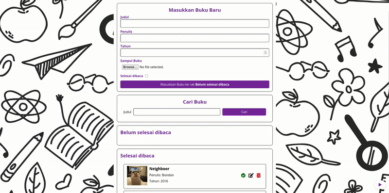

# Aplikasi Bookshelf

Sebuah aplikasi web sederhana dan modern untuk mengelola rak buku pribadi Anda. Anda bisa menambahkan, mencari, mengedit, dan menghapus buku, serta menandai buku sebagai sudah dibaca atau belum dibaca. Aplikasi ini juga dilengkapi dengan latar belakang kustom, gambar sampul buku, serta musik latar dengan tombol play/pause.

_Tampilan utama aplikasi Bookshelf_

## Fitur

- **Tambah Buku**: Masukkan judul, penulis, tahun, dan unggah gambar sampul (atau gunakan gambar default).
- **Edit Buku**: Perbarui detail buku dan ganti gambar sampul.
- **Hapus Buku**: Hapus buku dari rak Anda.
- **Pindahkan Buku**: Tandai buku sebagai **“Selesai dibaca”** atau **“Belum selesai dibaca”**.
- **Pencarian**: Temukan buku berdasarkan judul.
- **Penyimpanan Permanen**: Semua data disimpan di localStorage browser Anda.
- **Desain Responsif**: Berfungsi dengan baik di desktop maupun perangkat seluler.
- **Musik Latar**: Putar/jeda musik latar dengan tombol mengambang.

## Cara Menggunakan

1. **Tambah Buku**: Isi formulir di bagian atas, unggah gambar sampul (opsional), lalu klik tombol untuk menambahkan buku.
2. **Edit Buku**: Klik ikon pensil (edit) pada buku untuk membuka modal edit.
3. **Hapus Buku**: Klik ikon tempat sampah untuk menghapus buku.
4. **Pindahkan Buku**: Klik ikon centang untuk memindahkan buku antara rak **“Selesai dibaca”** dan **“Belum selesai dibaca”**.
5. **Pencarian**: Gunakan kolom pencarian untuk memfilter buku berdasarkan judul.
6. **Musik Latar**: Gunakan tombol play/pause di kanan bawah untuk mengontrol musik.

## Struktur Proyek

- `index.html` — File HTML utama
- `main.js` — Seluruh logika aplikasi (DOM, localStorage, musik, dll.)
- `style.css` — Semua gaya, termasuk responsif dan modal
- `image/` — Gambar sampul buku dan latar belakang
- `audio/` — File musik latar (misalnya `background.mp3`)

## Persyaratan

- Browser modern (Chrome, Firefox, Edge, dll.)
- Tidak memerlukan backend atau server (sepenuhnya berjalan di browser)

## Kustomisasi

- Ganti `image/default_book.png` untuk gambar sampul default.
- Ganti `image/book_wall.png` untuk latar belakang.
- Letakkan file musik Anda di `audio/background.mp3` atau perbarui path-nya di `index.html`.

## Kredit

- Ikon : [Font Awesome](https://fontawesome.com/)
- Font : [Google Fonts](https://fonts.google.com/)

---

Selamat mengelola rak buku Anda! 📚🎶
